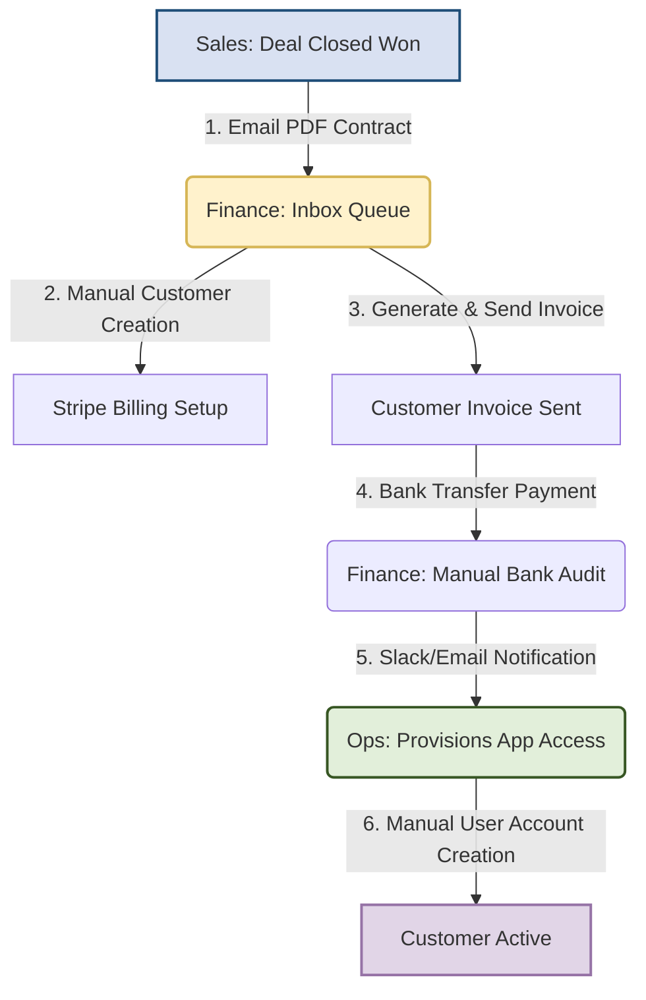

# Process Gap Analysis: B2B SaaS Onboarding & Billing Workflows

## Executive Summary
This document analyzes the current-state onboarding and billing workflows across Sales, Finance, and Operations functions. By mapping the operational path from a closed-won deal to active customer access, we identified three major process gaps where manual handoffs and double-entry systems introduce severe risks, including data inconsistencies, customer friction, and extended cycle times. Integrating automation across these handoffs is estimated to reduce manual reconciliation and coordination time by **~30%**.

---

## Current-State Workflow Diagram (Manual & Siloed)

---

## Detailed Identification of Process Gaps

### Gap 1: Manual Contract Handshake (Sales to Finance)
* **Current State**: Once a Sales representative closes a deal, they download the signed PDF contract from DocuSign and email it as an attachment to the Finance department's generic inbox (`billing@company.com`).
* **Root Cause**: No direct integration or webhook triggers exist between the CRM (Salesforce) or contract signing platform and the billing system.
* **Pain Points & Risks**:
  - **Delays**: Emails get buried; the average lag time between deal closure and invoice generation is **4.2 business days**.
  - **Lack of Visibility**: Sales cannot track whether billing has been set up, prompting frequent manual check-ins ("Where is the invoice?").
* **Proposed Automation Fix**: Configure a Salesforce webhook triggered by the `Stage = Closed Won` event to automatically push contract metadata directly into a Stripe Draft Invoice queue.

---

### Gap 2: Double-Entry Customer Setup (Stripe & Salesforce CRM)
* **Current State**: Finance managers open the email attachment, read the details, and manually type customer parameters (Company Name, Billing Email, Segment, Contract Value) into Stripe.
* **Root Cause**: Stripe and Salesforce operate as independent silos without shared metadata mapping.
* **Pain Points & Risks**:
  - **Data Inconsistencies**: Names are typed differently (e.g., "Acme Corp" in CRM vs. "Acme Corporation" in Stripe), breaking audit trails.
  - **High Error Rates**: Typographical errors affect billing emails (leading to bounced invoices) and MRR inputs (distorting revenue reports).
* **Proposed Automation Fix**: Utilize a Zapier or custom iPaaS connector to sync Salesforce Account objects with Stripe Customer objects via unique Salesforce Account IDs mapped to Stripe Metadata fields.

---

### Gap 3: Siloed Access Provisioning (Finance to Ops)
* **Current State**: Once a customer pays via bank transfer, Finance checks the bank ledger daily. Upon confirming receipt, they manually send a Slack message or email to the Operations/Product team requesting workspace provisioning.
* **Root Cause**: Product database/auth systems (Auth0) are isolated from billing systems (Stripe) and ledger databases.
* **Pain Points & Risks**:
  - **Delayed Time-to-Value**: Customers experience a **2.1-day lag** between payment confirmation and receiving login credentials, hurting Net Promoter Score (NPS).
  - **Security Exposure**: No automated system de-provisions access if a payment fails or if a customer churns, resulting in potential unpaid usage.
* **Proposed Automation Fix**: Configure a Stripe webhook for `invoice.payment_succeeded` that triggers a serverless function to invoke the Auth0 API (or product provisioning database) to instantly spin up the customer's workspace.

---

## Estimated Business Impact of Proposed Automation

| Process Metric | Current State (Manual) | Future State (Automated) | Operational Benefit |
| :--- | :--- | :--- | :--- |
| **Sales-to-Invoice Lag** | 4.2 days | < 5 minutes | Improved cash flow (Faster billing) |
| **Data Mismatch Rate** | 5.0% typo rate | 0% (System locked) | Zero audit leakage, clean CRM |
| **Time-to-Value (Access)** | 2.1 days | Instantly (< 2 mins) | Improved customer onboarding NPS |
| **Weekly Reconciliation Time** | 12.5 Hours | 8.8 Hours | **30% reduction** in staff manual overhead |
