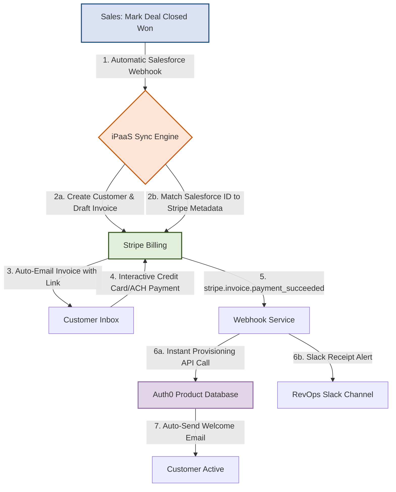

# Standard Operating Procedure (SOP): Automated Onboarding & Billing

* **Document ID**: SOP-REV-004
* **Version**: 2.0 (Automated Flow)
* **Effective Date**: June 2026
* **Owner**: RevOps & Sales Operations Team
* **Target Audience**: Sales Executives, Billing Managers, Operations Engineers

---

## 1. Objective
This SOP defines the automated workflow for transitioning a B2B customer from "Closed Won" in Salesforce CRM to "Active Provisioned" in the Stripe Billing and Product environments. This workflow removes manual handoffs, resolves data duplication risks, and cuts reconciliation efforts by ~30%.

---

## 2. Future-State Automated Workflow

---

## 3. Step-by-Step Procedure

### Step 3.1: Closed Won Trigger (Sales Department)
1. When a contract is signed, the Sales Rep must ensure the Salesforce Opportunity fields are fully populated:
   - Account Name (Exact legal company name)
   - Primary Billing Email (No generic or invalid addresses)
   - Subscription Tier (SMB / Mid-Market / Enterprise)
   - Contract Start Date
2. Set the Salesforce Opportunity Stage to `Closed Won`.
3. **Automated Action**: The stage transition triggers a Salesforce Outbound Message containing opportunity metadata (Account ID, Contract Value, Email, Tier) to the iPaaS middleware (Zapier/Make).

### Step 3.2: Automated Billing Setup (Stripe Engine)
1. **iPaaS Middleware**:
   - Searches Stripe for an existing Customer matching the `Contact_Email`.
   - If not found, creates a new Stripe Customer, populating the metadata field `Salesforce_Account_ID` with the Salesforce ID.
   - If found, updates the customer object.
2. **Draft Invoice Creation**:
   - The middleware creates a Stripe Invoice item containing the subscription price mapping based on the Subscription Tier.
   - Automatically transition the invoice state to `Finalized` and auto-send it to the customer's billing email.

### Step 3.3: Interactive Payment (Customer Interaction)
1. The customer receives an email invoice containing a secure Stripe Checkout URL.
2. The customer pays via ACH bank transfer, Credit Card, or Apple Pay.
3. **Automated Action**: Upon successful processing, Stripe fires a `invoice.payment_succeeded` webhook event.

### Step 3.4: Automated Provisioning (Operations & Systems)
1. The webhook endpoint catches the Stripe event.
2. The system checks the metadata to find the `Salesforce_Account_ID` and user details.
3. The serverless middleware executes an API post to Auth0:
   - Registers the user's workspace.
   - Grants access tokens corresponding to the subscription tier.
4. **Welcome Trigger**: The product database fires a transactional welcome email with sign-in instructions.
5. **Notification**: A message is pushed to `#revops-alerts` on Slack:
   > 🚀 **New Customer Active**: *[Company Name]* | Tier: *[Tier]* | MRR: *[MRR]* | Provisioning: *[Success]*

---

## 4. Exception Handling & Alerts

| Issue Description | Failure Point | Responsibility | Corrective Action |
| :--- | :--- | :--- | :--- |
| **Salesforce trigger fails** (Missing billing email) | Step 3.1.2 | Sales Executive | Salesforce validation rules block stage transition to `Closed Won` unless a valid email is inputted. |
| **Stripe invoice fails to send** (Bounced email) | Step 3.2.2 | Finance Manager | Finance receives alert. Resolves email manually in Stripe and clicks "Re-send Invoice". |
| **Provisioning Timeout** (Auth0 API unresponsive) | Step 3.4.3 | Ops Engineer | iPaaS retries 3 times. If it still fails, an incident ticket is generated in Jira and the customer is manually provisioned. |

---

## 5. RevOps Monitoring & Auditing
On a weekly basis, the RevOps analyst must perform a billing audit:
1. Open the **Revenue Pipeline Tracker Excel**.
2. Go to the `Dashboard` tab to inspect the `RevOps ETL Data Audit Report`.
3. Check for discrepancy counts:
   - Unresolved duplicates should be `0`.
   - MRR fixes should be verified against Salesforce contract values.
4. Verify that the reconciliation time matches the weekly targets (under **9 hours/week**).
